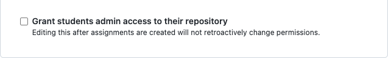

# Stoplight

[](https://github.com/mariakimheinert/stoplight/actions/workflows/main.yml)
[](https://pypi.org/project/pystoplight)

[](https://pypi.org/project/pystoplight/#files)
[](https://github.com/mariakimheinert/stoplight/blob/master/LICENSE)

`stoplight` is a tool that enables educators to easily control push access to GitHub Classroom assignment repositories.

Please note that, as of now, `stoplight` only supports at most 100 student repositories per GitHub Classroom assignment.

## Installation

Python 3.10 required. [`pipx`](https://pypa.github.io/pipx/) recommended.

```console
pipx install pystoplight
```

## Usage

### Authentication

Requires a [GitHub personal access token](https://docs.github.com/en/authentication/keeping-your-account-and-data-secure/creating-a-personal-access-token).

Once created, place in your `.stoplightrc` file, which you can store either in the directory where you execute `stoplight` or in your home directory.

```toml
token = "<TOKEN>"
```

Or, you can pass it in as the value of the `--token` option.

```console
stoplight red --token <TOKEN>
```

### Commands

#### `stoplight status`

To check the permissions of all student repositories for a GitHub Classroom assignment, use `stoplight status`.

```console
$ stoplight status --org stoplight-demo --assignment-title assignment
Checking Status  [####################################]  100%
                         assignment                          
┏━━━━━━━━━━━━━━━━━━━━━━━━━━━━┳━━━━━━━━━━━━━━━━━┳━━━━━━━━━━━━┓
┃ Repo                       ┃ User            ┃ Permission ┃
┡━━━━━━━━━━━━━━━━━━━━━━━━━━━━╇━━━━━━━━━━━━━━━━━╇━━━━━━━━━━━━┩
│ assignment-Michionlion     │ Michionlion     │ write      │
│ assignment-mariakimheinert │ mariakimheinert │ admin      │
└────────────────────────────┴─────────────────┴────────────┘
```

Note that repositories whose names end with `starter` or `solution` or that are the assignment title are excluded.

You can also specify the organization and assignment title in your `.stoplightrc`.

```toml
token = "<TOKEN>"
org = "stoplight-demo"
assignment_title = "assignment"
```

```console
$ stoplight status
Checking Status  [####################################]  100%
                         assignment                          
┏━━━━━━━━━━━━━━━━━━━━━━━━━━━━┳━━━━━━━━━━━━━━━━━┳━━━━━━━━━━━━┓
┃ Repo                       ┃ User            ┃ Permission ┃
┡━━━━━━━━━━━━━━━━━━━━━━━━━━━━╇━━━━━━━━━━━━━━━━━╇━━━━━━━━━━━━┩
│ assignment-Michionlion     │ Michionlion     │ write      │
│ assignment-mariakimheinert │ mariakimheinert │ admin      │
└────────────────────────────┴─────────────────┴────────────┘
```

One way to use the `.stoplightrc` is to store it in a directory that you use to store starter and solution files for a GitHub Classroom assignment. Then, you can use `stoplight` from that directory to control the push access to that GitHub Classroom assignment. A `.stoplightrc` in the directory from which `stoplight` is executed will be given priority over a `.stoplightrc` in your home directory.

#### `stoplight red`

To disable push access for all students to their GitHub Classroom assignment repositories, use `stoplight red`.

```console
$ stoplight red
Updating Permissions  [####################################]  100%
Checking Status  [####################################]  100%
                         assignment                          
┏━━━━━━━━━━━━━━━━━━━━━━━━━━━━┳━━━━━━━━━━━━━━━━━┳━━━━━━━━━━━━┓
┃ Repo                       ┃ User            ┃ Permission ┃
┡━━━━━━━━━━━━━━━━━━━━━━━━━━━━╇━━━━━━━━━━━━━━━━━╇━━━━━━━━━━━━┩
│ assignment-Michionlion     │ Michionlion     │ read       │
│ assignment-mariakimheinert │ mariakimheinert │ admin      │
└────────────────────────────┴─────────────────┴────────────┘
```

Notice that you cannot update the permissions of students who have admin access to their GitHub Classroom assignment repository. So, if you want to use `stoplight`, leave the following box unchecked when creating your GitHub Classroom assignment.



#### `stoplight green`

To enable push access for students to their GitHub Classroom assignment repositories, use `stoplight green [STUDENTS]...`.

```console
$ stoplight green Michionlion
Updating Permissions  [####################################]  100%
Checking Status  [####################################]  100%
                     assignment                      
┏━━━━━━━━━━━━━━━━━━━━━━━━┳━━━━━━━━━━━━━┳━━━━━━━━━━━━┓
┃ Repo                   ┃ User        ┃ Permission ┃
┡━━━━━━━━━━━━━━━━━━━━━━━━╇━━━━━━━━━━━━━╇━━━━━━━━━━━━┩
│ assignment-Michionlion │ Michionlion │ write      │
└────────────────────────┴─────────────┴────────────┘
```

You can also use the `--all` option to enable push access for all students.

```console
$ stoplight red
Updating Permissions  [####################################]  100%
Checking Status  [####################################]  100%
                         assignment                          
┏━━━━━━━━━━━━━━━━━━━━━━━━━━━━┳━━━━━━━━━━━━━━━━━┳━━━━━━━━━━━━┓
┃ Repo                       ┃ User            ┃ Permission ┃
┡━━━━━━━━━━━━━━━━━━━━━━━━━━━━╇━━━━━━━━━━━━━━━━━╇━━━━━━━━━━━━┩
│ assignment-Michionlion     │ Michionlion     │ read       │
│ assignment-mariakimheinert │ mariakimheinert │ admin      │
└────────────────────────────┴─────────────────┴────────────┘
$ stoplight green --all
Updating Permissions  [####################################]  100%
Checking Status  [####################################]  100%
                         assignment                          
┏━━━━━━━━━━━━━━━━━━━━━━━━━━━━┳━━━━━━━━━━━━━━━━━┳━━━━━━━━━━━━┓
┃ Repo                       ┃ User            ┃ Permission ┃
┡━━━━━━━━━━━━━━━━━━━━━━━━━━━━╇━━━━━━━━━━━━━━━━━╇━━━━━━━━━━━━┩
│ assignment-Michionlion     │ Michionlion     │ write      │
│ assignment-mariakimheinert │ mariakimheinert │ admin      │
└────────────────────────────┴─────────────────┴────────────┘
```

For additional information, use `stoplight --help`.
